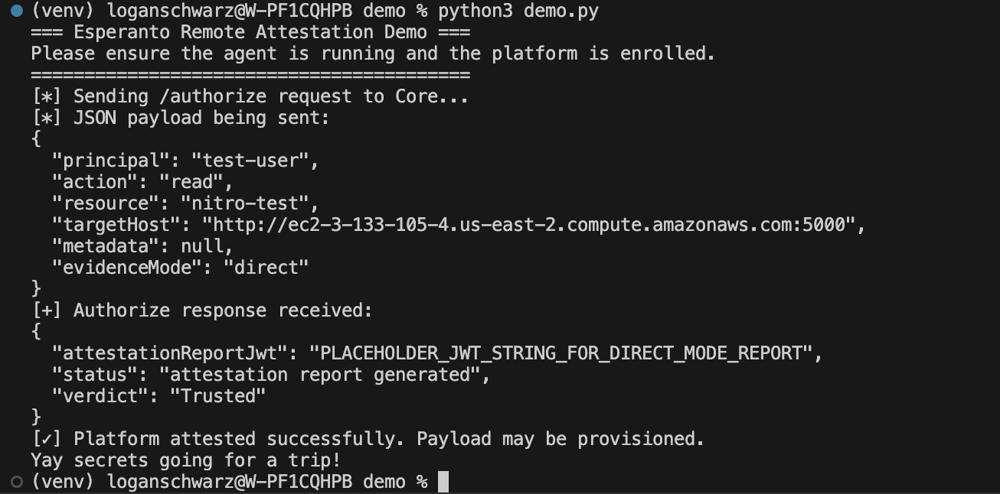
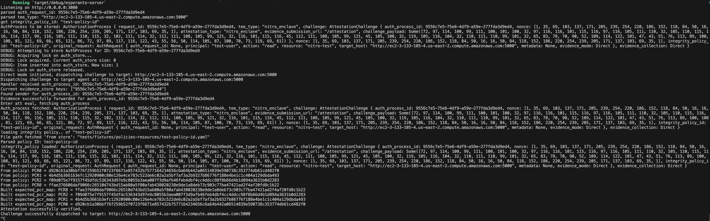
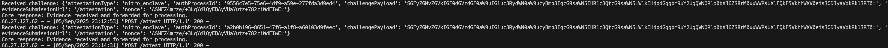
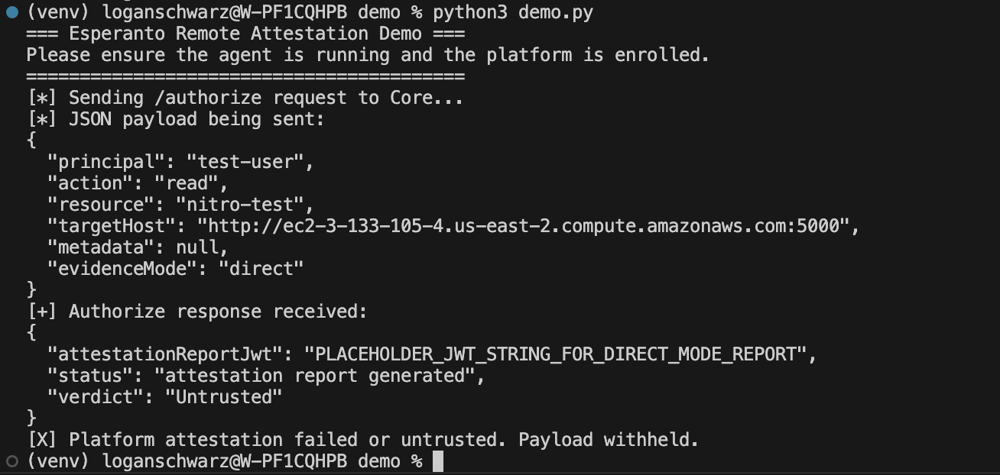
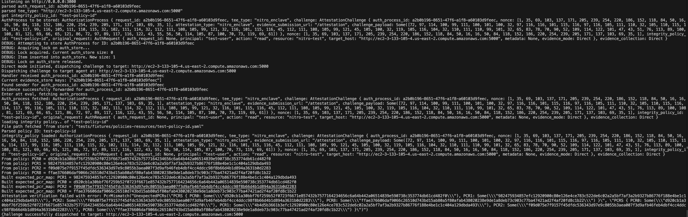

# Esperanto Remote Attestation Demo

This demo is designed to give context as to how to integrate remote attestation into your workflows using Esperanto.

- **Goal A:** Remote attestation actually verifies the integrity of a remote platform.
- **Goal B:** The Esperanto platform makes enrollment, attestation checks, and secure payload delivery simple and unified.
- **Goal C:** Multi-platform integration (e.g., **Nitro → Keylime**) illustrates real-world **composability**. TBH this part aint done. LOL~!

This demo also doesn't do anythign with userdata or pub key.

---

## Demo Script

```python
#!/usr/bin/env python3
"""
Esperanto Demo Script
----------------------
Shows how remote attestation works via the Core service.

Flow:
1. Platform is already enrolled separately via `python3 agent.py enroll`.
2. Demo script -> Core /authorize API to check trust.
   (Core internally waits for agent attestation callback.)
3. If trusted, deliver a payload.
4. If untrusted, deny delivery.


General usage
---------------
resp = requests.post("http://core:3000/authorize", json=my_auth_request)
if resp.json()["verdict"] == "Trusted":
    do_sensitive_action()

"""

import requests
import uuid
import sys
import json

CORE_URL = "http://127.0.0.1:3000"

def run_demo():
    auth_request = {
        # omit requestId to let Core generate
        "principal": "test-user",
        "action": "read",
        "resource": "nitro-test",
        "targetHost": "http://ec2-3-133-105-4.us-east-2.compute.amazonaws.com:5000",
        "metadata": None,   # optional, null
        "evidenceMode": "direct"
    }

    print("[*] Sending /authorize request to Core...")
    print("[*] JSON payload being sent:")
    print(json.dumps(auth_request, indent=2))

    try:
        resp = requests.post(
            f"{CORE_URL}/authorize",
            json=auth_request,
            headers={"Content-Type": "application/json"},
            timeout=60
        )
        resp.raise_for_status()
    except requests.HTTPError as e:
        print(f"[!] HTTPError: {e}")
        print(f"[!] Response content: {resp.text}")
        sys.exit(1)

    body = resp.json()
    print("[+] Authorize response received:")
    print(json.dumps(body, indent=2))

    verdict = body.get("verdict")
    if verdict == "Trusted":
        print("[✓] Platform attested successfully. Payload may be provisioned.")
        deliver_secrets()
    else:
        print("[X] Platform attestation failed or untrusted. Payload withheld.")

def deliver_secrets():
    print("Yay secrets going for a trip!")

if __name__ == "__main__":
    print("=== Esperanto Remote Attestation Demo ===")
    print("Please ensure the agent is running and the platform is enrolled.")
    print("=========================================")
    run_demo()
```

## Walkthrough

This walkthrough shows Esperanto in action — from enrolling a platform, attesting its state, simulating tampering, and re-attesting to see the change.

---

### Step 1: Enroll

**Command:**

```bash
# Example command
python3 esperanto_agent.py enroll aws_enclave
```

**Screenshot**

**Description:**
Enrollment registers the enclave or platform with Esperanto Core in its expected trusted state. This “known-good” baseline is used for all future attestations. It creates a policy for you to manage:

```yaml
id: test-policy-id
name: Test Nitro Enclave
description: A test policy for a Nitro Enclave
platform_attestation_params:
  type: AwsNitroEnclave
  id: test-policy-id
  name: Test Nitro Enclave
  description: A test policy for a Nitro Enclave
  expected_pcrs:
    - index: 0
      value: vault://goldenvault/nitro/test-policy-id/pcr0
    - index: 1
      value: vault://goldenvault/nitro/test-policy-id/pcr1
    - index: 2
      value: vault://goldenvault/nitro/test-policy-id/pcr2
    - index: 8
      value: vault://goldenvault/nitro/test-policy-id/pcr8
  expected_public_key: 6d7920737570657220736563726574206b6579
  expected_user_data: 68656c6c6f2c20776f726c6421
  nonce_required: true
```

Measurements are not stored directly in the human-readable policy because policies are meant to be portable and may change. Instead, measurements are kept locally as a single source of truth. Expected values—like PCRs—are resolved from the policy at evaluation time. This approach prevents accidental or malicious modification of measurements, and keeps sensitive platform details hidden. While PCRs are not strictly secret (they are only valid in signed attestation reports), exposing them unnecessarily could give an attacker an advantage, so they are never stored in a policy file.

### Step 2: Attest

**Demo Script Output**



**Core Logs**



Importantly...

```
...
From policy: PCR0 = d920cb1a30bbf76f259b52f0723f6671e857432b7577164234656c6a64b442a06514839e590738c353774db61cd482f0
From policy: PCR1 = 4b4d5b3661b3efc12920900c80e126e4ce783c522de6c02a2a5bf7af3a2b9327b86776f188e4be1c1c404a129dbda493
From policy: PCR2 = f09d075e7f9157f45dfdc536343d97e9c8055b3aea007f3d9afb46feb4dbf4cc4ddcc98f8b66d4b1d894a3631b0d2283
From policy: PCR8 = ffae376606daf9066c26510d743bd15ab80a5f80afab438020238e9de1a8deb73c903c77ba47421ad2f4af20fd8c1b22
Built expected_pcr_map: PCR2 = f09d075e7f9157f45dfdc536343d97e9c8055b3aea007f3d9afb46feb4dbf4cc4ddcc98f8b66d4b1d894a3631b0d2283
Built expected_pcr_map: PCR0 = d920cb1a30bbf76f259b52f0723f6671e857432b7577164234656c6a64b442a06514839e590738c353774db61cd482f0
Built expected_pcr_map: PCR1 = 4b4d5b3661b3efc12920900c80e126e4ce783c522de6c02a2a5bf7af3a2b9327b86776f188e4be1c1c404a129dbda493
Built expected_pcr_map: PCR8 = ffae376606daf9066c26510d743bd15ab80a5f80afab438020238e9de1a8deb73c903c77ba47421ad2f4af20fd8c1b22
Attestation successfully verified.
...
```

**Agent Logs**



```
Received challenge: {'attestationType': 'nitro_enclave', 'authProcessId': 'a2b0b196-8651-47f6-a1f8-a60103d9feec', 'challengePayload': 'SGFyZGNvZGVkIGF0dGVzdGF0aW9uIGluc3RydWN0aW9ucyBmb3IgcG9saWN5IHRlc3QtcG9saWN5LWlkIHdpdGggbm9uY2UgQVNORlo0bXJ6ZS8rM0xxWWRsUXlFQkF5VkhhWXV0eis3ODJyaVdkRkl3RT0=', 'evidenceSubmissionUrl': '/attestation', 'nonce': 'ASNFZ4mrze/+3LqYdlQyEBAyVHaYutz+782riWdFIwE='}
Core response: Evidence received and forwarded for processing.
66.27.127.62 - - [05/Sep/2025 23:14:31] "POST /attest HTTP/1.1" 200 -
```

**Description:**
The attestation process cryptographically measures the platform against its enrolled baseline. A successful result confirms the enclave is uncompromised and eligible for sensitive operations (e.g., key provisioning, authorization).

At this point its up to your business logic to decide what to do - do_sensitive_action()

### Step 3: Tamper with Enclave

Something like... For the real real demo, I think it'll be good to load some sus binary into the enclave and show that it is no good.

```
// Simulate a compromise by altering a PCR value in the resolved policy
let mut tampered_policy = original_policy.clone();
tampered_policy.expected_pcr_map.insert("PCR1".to_string(), "982475934857efc12920900c80e126e4ce783c522de6c02a2a5bf7af3a2b9327b86776f188e4be1c1c404a129dbda493".to_string());
```

// Re-run attestation check
let result = verify*attestation(&tampered_policy, &attestation_report);
assert!(matches!(result, Err(CoreError::PcrMismatch(*))));
**Description:**
Here we simulate a compromise by modifying the enclave state (e.g., changing a binary!!, altering the environment). This breaks the integrity guarantee captured during enrollment.

### Step 4: Attest Again

**Screenshot:**

**Demo Script Output**





Importantly... PCR1 (output formatted for readabiliy)

```rust
Attestation verification failed with error: PcrMismatch(
    "UnexpectedPCRs(
        \"PCRS {
            PCR0: Some(\\\"d920cb1a30bbf76f259b52f0723f6671e857432b7577164234656c6a64b442a06514839e590738c353774db61cd482f0\\\"),
            PCR1: Some(\\\"982475934857efc12920900c80e126e4ce783c522de6c02a2a5bf7af3a2b9327b86776f188e4be1c1c404a129dbda493\\\"),
            PCR2: Some(\\\"f09d075e7f9157f45dfdc536343d97e9c8055b3aea007f3d9afb46feb4dbf4cc4ddcc98f8b66d4b1d894a3631b0d2283\\\"),
            PCR8: Some(\\\"ffae376606daf9066c26510d743bd15ab80a5f80afab438020238e9de1a8deb73c903c77ba47421ad2f4af20fd8c1b22\\\")
        }\",
        \"PCRS {
            PCR0: Some(\\\"d920cb1a30bbf76f259b52f0723f6671e857432b7577164234656c6a64b442a06514839e590738c353774db61cd482f0\\\"),
            PCR1: Some(\\\"4b4d5b3661b3efc12920900c80e126e4ce783c522de6c02a2a5bf7af3a2b9327b86776f188e4be1c1c404a129dbda493\\\"),
            PCR2: Some(\\\"f09d075e7f9157f45dfdc536343d97e9c8055b3aea007f3d9afb46feb4dbf4cc4ddcc98f8b66d4b1d894a3631b0d2283\\\"),
            PCR8: Some(\\\"ffae376606daf9066c26510d743bd15ab80a5f80afab438020238e9de1a8deb73c903c77ba47421ad2f4af20fd8c1b22\\\")
        }\"
    )"
)
```

**Description:**
When attestation is run again, Esperanto detects the mismatch against the trusted baseline. The enclave is flagged as untrusted, and sensitive operations (like secret release or authorization) are denied

## Summary

In this demo, we walked through enrolling a platform with Esperanto, performing a remote attestation, simulating a tamper, and re-attesting to see the system detect the compromise. Remote attestation verifies that a platform matches its expected trusted state, and Esperanto simplifies enrollment, measurement verification, and secure payload delivery.

Failures in attestation can occur for several reasons beyond deliberate tampering, including:

- **Nonce expiration** – the challenge issued by Core is no longer valid.
- **Invalid or incomplete root certificate chain** – the attestation report cannot be verified against trusted roots.
- **Incorrect PCR measurements** – the platform state differs from the expected baseline.

By resolving expected values like PCRs at evaluation time and keeping measurements local, Esperanto ensures integrity while minimizing the risk of exposing sensitive platform details. This demo illustrates how even small changes to the enclave state are reliably detected, keeping sensitive operations safe.

Email **loganjsch@gmail.com** for feedback, questions, concerns, interest, insults....
