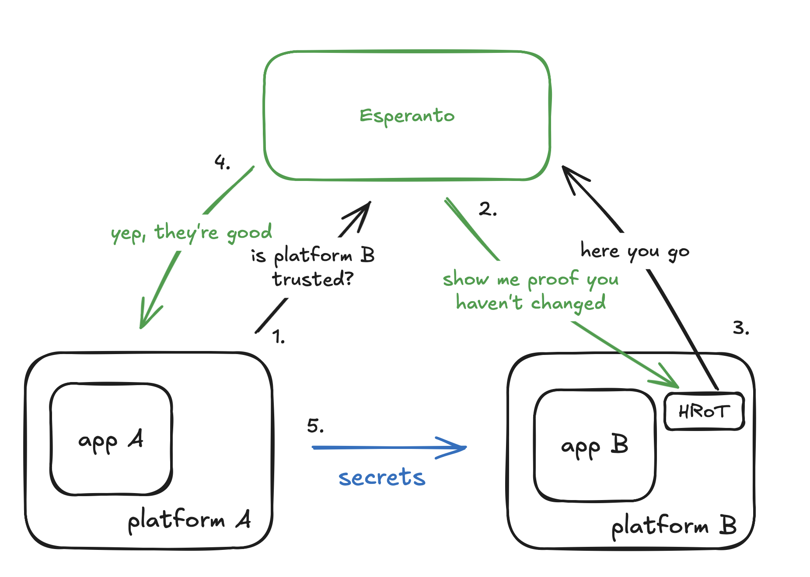

**Esperanto** is a fast, secure, and highly scalable service for unified integration of Remote Attestation (RA) across your workflows.

Esperanto standardizes RA workflows across platforms by abstracting away vendor complexity without replacing their underlying cryptographic roots of trust — so you gain portability and scale while preserving the same hardware-level assurances.

RA enables you to verify the integrity of your systems and enforce trust across cloud, edge, and device deployments — protecting your applications and secrets by proving your firmware, OS/kernel, and virtualization/TEE environment are uncompromised.
To learn more about Remote Attestation itself, see [What is Remote Attestation?](/ra_overview).

---

## Why Esperanto?

Unfortunately, Remote Attestation is:

- Cryptographically complex
- Operationally hard to manage at scale
- Inconsistent across platforms and vendors

**Esperanto solves this problem.**

With Esperanto, you integrate RA into applications with a simple API, without needing deep cryptographic expertise. Esperanto handles vendor quirks so you can focus on building. Simply,

1. **Enroll** a platform in its trusted state.
2. **Attest** the cryptographic state of that platform **just-in-time (JIT)** before any sensitive or secure operation.

Esperanto does not reinvent the wheel — it builds on the **RATS framework (Remote ATtestation Procedures)** published by IETF.  
[Read more about the RATS framework](/reference/rats).

---

## How Esperanto Works

Esperanto consists of a core service that receives attestation evidence and evaluates it against conditions defined in a trusted state. Platform agents handle requests from the core, interact with the environment’s hardware root of trust (HRoT) to collect system measurements, and forward those signed measurements back to the core.

At a very high level, the interaction looks like this:

## When to Use Esperanto

Esperanto is ideal whenever you need **platform trust at scale**. Whether you’re already leveraging RA in TEEs and confidential computing, or building new workloads that demand cryptographic proof of trust, Esperanto simplifies attestation, unifies policies, and enforces trust consistently across clouds, edge, and on-prem systems.

### Key Scenarios

1. **Organizations Already Using RA**

   - AWS Nitro Enclaves, GCP Confidential Cloud, Azure Confidential Computing, OP-TEE, SGX, TPM/Keylime, etc.
   - **Esperanto benefit:** One consistent API, unified orchestration, and simplified evaluation across heterogeneous environments.

2. **New Workloads Requiring Low-Level Trust**
   - Edge devices in untrusted environments
   - High-value AI/ML inference or cryptographic workloads
   - Forward-deployed, resource-constrained systems
   - Zero-trust platform implementations
   - **Esperanto benefit:** Plug-and-play attestation engine — handles collection and verification so you can focus on using the trust results.

> For slightly more detailed examples of how Esperanto integrates with SaaS, edge, multi-cloud, and compliance-heavy workloads, see our [use cases](/usecases).

## Key Takeaways

- **Unified Attestation**: Esperanto standardizes RA across enclaves, TPMs, and diverse TEEs.
- **Scalable Trust**: Operates seamlessly from the cloud to the edge.
- **Built on Standards**: Fully aligned with the RATS framework.
- **Practical Security**: Turns complex attestation into a manageable, enforceable part of your workflow.
