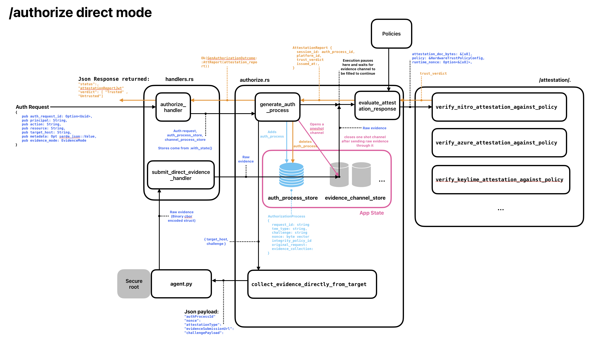

Here are the details as to how the Esperanto Core works. TBH, this is probably not something that should be shared. :)

## Authorize with Evidence Mode: Direct

<!--  -->

Please note, there is some serious clean up to be done regarding the challenge, and whittling down to only passing around exactly what data needs to be, there are still leftovers from iterations.
