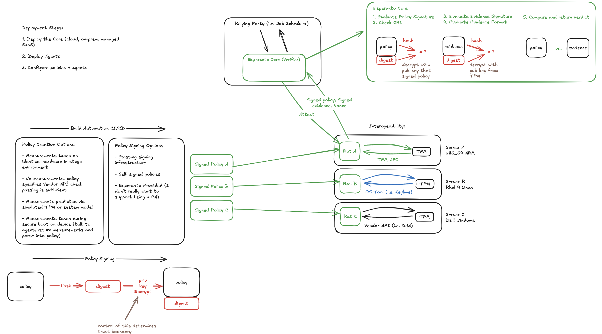

### Specification

View the Esperanto specification:

/github link

### Diagram

<!--  -->

## Overview

Ratatouille is broken into 4 components:

1. Policy Pipeline
2. Esperanto Core
3. Verification Engine
4. On device rats

# Components

The composition of these components constitutes ‘Esperanto,’ however the specific implementation at each component should as customizable as possible. As a general rule, ‘Esperanto’ offers a standard for each component out of the box, but custom implementations are possible and encouraged.

## Policy CI/CD

> The GitOps-integrated component responsible for securely signing and propagating policy-as-code changes into the verification system.

**Core Elements:**

- User-owned `runtime-boot-policies` repo. (Anything)
- Git provider webhook (configured by Esperanto) pointing to this pipeline.
- Secure access to signing keys (e.g., via CI/CD secrets, SPIFFE/SPIRE, or a service like Sigstore's Fulcio).
- Integration with a transparency log (e.g., **Sigstore Rekor**) to publish proof of policy generation.
- Policy creation scripts

**Responsibilities:**

- **Receiving** Git events (e.g., "merge to main") via the webhook.
- **Validating** the commit metadata (e.g., checking for an associated RFC or PR approval, as in flow 3b).
- **Generating/Updating** the policy artifact (e.g., regenerating IMA allowlists based on new kernel info, modifying the Measured Boot Reference State MBRS).
- **Signing** the final policy artifact (e.g., `policy.json`) to prove it came from this trusted pipeline.
- **Publishing** the signature and policy hash to the Rekor transparency log.
- **Notifying** the **Esperanto Core** via an API call, providing the new policy, its signature, and its log entry.

## WebApp Interface

> Standard UI for fleet visualization, policy management, and system onboarding.

**Responsibilities:**

- **User Authentication:**
  - Integrates with SSO for user sign-in (Flow 1.1).
- **Onboarding Workflow:**
  - Manages OAuth flow to connect to Git providers (GitHub/GitLab) (Flow 1.2).
  - Provides an interface to select the policy repository (Flow 1.3).
  - Triggers the **Esperanto Core** to install the necessary webhook (Flow 1.4).
- **Fleet & Policy Visualization:**
  - Displays the fleet status (Attested/Failed) from the Esperanto Core (Flow 2).
  - Shows active policies and the Git commit history (Policy View, History Tab).
- **Access Management:**
  - Generates and displays the **API token** required for agent enrollment (Flow 1.5).

## Esperanto Core

> This is the central backend and control plane for the entire system. It bridges the CI/CD pipeline, the WebApp, and the Verifier.

**Responsibilities:**

- **API Provider:**
  - Provides the API for the **WebApp** (fleet status, policy history, etc.).
  - Provides the API for the **Policy CI/CD** pipeline to submit new policy versions.
  - Provides the **Enrollment API** used by the `curl` script (validates `YOUR_API_TOKEN`) (Flow 1.5).
- **Policy Lifecycle:**
  - **Receives** new policies from the Policy CI/CD pipeline.
  - **Validates** the policy's integrity by checking its signature and verifying its entry in the transparency log (Rekor) (Flow 3).
  - **Stores and manages** the *validated* policy versions and associated metadata for the fleet for audibility.
- **Git Integration:**
  - Manages Git provider API credentials (from OAuth) to automatically install webhooks on user repos (Flow 1.4).
- **Agent Management:**
  - Tracks the state, identity, and policy group for all enrolled RATs (e.g., "machine `web-99` belongs to `web-servers` group").
  - Ability to contact verifier system to update, add, or delete Agents.
- **Verifier Configuration:**
  - Automatically configures the Verifier (e.g., Keylime). It pushes the ’*active’, signed policy* to the Verifier and instructs it to use that specific policy for a specific group of agents.
- **Extensibility:**
  - Provides a "Verifier Adapter Interface" to allow plugging in different verifiers (Keylime, Windows attestation, etc.) without changing the Core logic.

## Verifier

> Responsible for communicating with and evaluating evidence collected by agents.

Keylime has components itself (registrar, verifier, tenant) but for the sake of Esperanto these are all the ‘verifier.’

## Rats (Agents)

> On device services responsible for translating evidence requests from verifier into Quotes of PCRs from the TPM, IMA runtime logs, and any other evidence.

### Policy Pipeline

This is core component of what enables automated and continous control of trust. By enforcing policy-as-code practices into the RATS architecutre, we can deploy a policy pipeline which gurantees confidence that the policies your hardware evidence is being evaluated against is the same changes that were authorized into your repo.

Here are the details as to how the Esperanto Core works. TBH, this is probably not something that should be shared. :)
